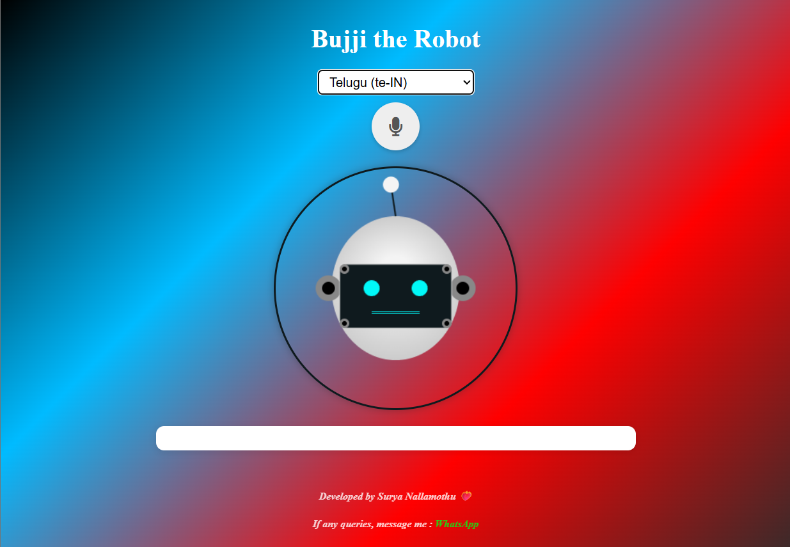

# Bujji: Friendly Conversational Voice Assistant



**Developed and Trained by Surya Nallamothu**  
GitHub: [nallamothusurya](https://github.com/nallamothusurya)  
Email: ayyappanallamothu4@gmail.com

---

## Live Demo

🌐 **Try the app live:** [https://chitti-zeta.vercel.app/](https://chitti-zeta.vercel.app/)

---

## Overview

**Bujji** is a friendly, multilingual conversational voice assistant built with Flask and powered by Google's Gemini model. Designed to interact naturally and empathetically, Bujji provides text and voice responses, supports multiple languages, and can even open websites or system apps via conversational commands.

---

## Features

- **Conversational AI**: Uses Gemini (gemini-2.0-flash) for natural, supportive, and context-aware responses.
- **Multilingual Support**: Detects and responds in the user's language; TTS supports many languages.
- **Text-to-Speech (TTS)**: Converts AI responses to speech using Google TTS, delivered as audio.
- **Speech Recognition**: Converts spoken input to text via Google Speech Recognition.
- **Contextual Awareness**: Integrates current date and time into conversations for context.
- **App/Website Opening**: Recognizes commands to open external sites/apps (e.g., "open YouTube" → "OPEN: https://www.youtube.com").
- **Profanity Handling**: Can mirror user tone, including mild profanity if contextually appropriate.
- **Caching**: In-memory caching for fast repeated queries and TTS responses.
- **Responsive Web UI**: Simple interface for chatting, listening, and speaking.

---

## How It Works

- **API Key**: Requires a Google Generative AI API key (`api_key` in the code).
- **Gemini Model**: Queries are sent to Gemini with a custom system instruction for friendly, human-like responses.
- **TTS**: Responses are spoken aloud using `gTTS`, with language detection via `langdetect`.
- **Speech-to-Text**: Users can submit audio; speech is transcribed using `speech_recognition`.
- **Web Interface**: Served via Flask, with endpoints for chat and speech.

---

## Setup & Installation

1. **Clone the Repository**
   ```bash
   git clone https://github.com/nallamothusurya/YOUR_REPO_NAME.git
   cd YOUR_REPO_NAME
   ```

2. **Install Dependencies**
   ```bash
   pip install flask google-generativeai gtts langdetect SpeechRecognition
   ```

3. **Set Up Your API Key**
   - Replace `api_key` in `app.py` with your Google Generative AI key.

4. **Run the App**
   ```bash
   python app.py
   ```
   The app will be available at `http://localhost:5000`.

---

## Usage

- **Home Page**: Visit `/` to interact via chat and voice.
- **Chat**: Type a message and receive a conversational reply.
- **Voice**: Listen to responses or send voice messages for transcription.
- **Open Apps/Websites**: Type commands like "open YouTube" to receive actionable links.

---

## Endpoints

- `/` : Main web interface.
- `/query` : POST endpoint for text queries. Returns Gemini response and TTS audio (base64).
- `/speech-to-text` : POST endpoint for audio file uploads; returns transcript.

---

## Screenshot


---

## Author & Contact

- **Surya Nallamothu**
  - GitHub: [nallamothusurya](https://github.com/nallamothusurya)
  - Email: ayyappanallamothu4@gmail.com

---

## License

MIT License. See [LICENSE](LICENSE) for details.

---

## Acknowledgements

- [Google Generative AI](https://ai.google)
- [gTTS](https://pypi.org/project/gTTS/)
- [SpeechRecognition](https://pypi.org/project/SpeechRecognition/)
- [langdetect](https://pypi.org/project/langdetect/)
